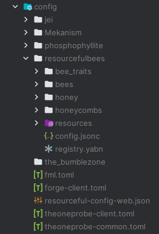

---
layout:
  title:
    visible: true
  description:
    visible: false
  tableOfContents:
    visible: true
  outline:
    visible: true
  pagination:
    visible: true
---

# Creating A Custom Bee

Resourceful Bees more modern, codec-driven API, enables pack developers and players to create custom bees varying in degree of complexity easily. Bee creation can feel overwhelming at first, but luckily for creators, a vast majority of available customization options are optional and most options have some kind of default value available, with vanilla-matching values provided where necessary.&#x20;


When the default value for an available option is desired, it is acceptable to omit the entry from the JSON.&#x20;



## Fundamental Overview

***

At the most basic, high-level view, the creation of a custom bee requires a minimal number of key components to come to life. Below we will highlight the absolute bare minimum required to make a bee as well as additional customizations:


### Minimum Requirements

Simply placing a properly structured JSON file in the right location will create a bee. However, the bee may not have the right appearance, create honeycombs, spawn, breed, etc without some additional context.&#x20;


### Additional Customizations

In addition to the bee JSON, a player or pack developer may want to provide custom textures, translations, models, animations, traits, mutations, honeys and honeycombs, various recipes, and more:

* Custom textures, models, and animations will all affect the appearance of the bee.
* Translations make any text associated with the bee display in the proper language.
* Honeys and honeycombs can be created independently from bees so that more than one bee can utilize a honey or honeycomb.
* Traits and mutations can also be created independently so as to be reusable.
* Various supporting recipes can be created for blocks such as the centrifuge, solidifier, flow hive, breeder, etc.


## File Structure

***

Traits, bees, honeys, and honeycombs are all customized in the `resourcefulbees` config folder. They can also be customized via the datapack data folder as well. The datapack location is useful for supporting mods which may want to add their own custom bees when loaded alongside Resourceful Bees, however the config folder is a better location for pack developers and players due to the caveats associated with how bees, honeys, and combs are registered to the game.&#x20;

<div align="center" data-full-width="false">

<figure><figcaption><p>An example of what the config folder might look like after a first run of the mod.</p></figcaption></figure>

</div>



The `bee_traits` folder is where all custom traits should go.

`<pack instance>/config/resourcefulbees/bee_traits`



The `bees` folder is where all custom bees should go.

`<pack instance>/config/resourcefulbees/bees`



The `honey` folder is where all custom honeys should go.&#x20;

`<pack instance>/config/resourcefulbees/honey`



The `honeycombs` folder is where all custom honeycombs should go.&#x20;

`<pack instance>/config/resourcefulbees/honeycombs`



The `resources` folder functions as any normal resource pack `resources` folder would.&#x20;

`<pack instance>/config/resourcefulbees/resources`




### Language Files

***

Language files allow text displayed in game to be displayed in various languages. Not providing an entry in a language file will cause names to appear something like this:

`item.resourcefulbees.blaze_honeycomb`


For new mod installs, run the game at least once so all necessary config files and folders can be generated



### Creating a Language File

***

1. Locate the `resourcefulbees` config folder inside the main config folder.
2. Before we begin the process of adding a language file we need to verify that specific resource and data pack files have been generated:
3. Inside the `resourcefulbees` folder there should be another folder labeled `resources`
4. Open this folder and verify there is a file inside called `pack.mcmeta`
   1. This file is needed for the loading of the language files.&#x20;
   2. If you do not see this file then reload the mod/pack to generate it.
5. Inside the `resources` folder we need to add the following nested folders: `assets/resourcefulbees/lang`
6.  The structure should appear as the following image:

    
7. Inside the `lang` folder, creating a file called `en_us.json` will create an English US language file.
8. You can specify a different language using any one of the language codes found [here](https://minecraft.wiki/w/Language) under the **Available languages** section.
9.  Every custom bee added should have language entries similar to the Blaze example below:

    ```json
    {
       "block.resourcefulbees.blaze_honeycomb_block": "Blaze Honeycomb Block",
       "item.resourcefulbees.blaze_honeycomb": "Blaze Honeycomb",
       "item.resourcefulbees.blaze_spawn_egg": "Blaze Bee Spawn Egg",
       "entity.resourcefulbees.blaze_bee": "Blaze Bee"
    }
    ```
10. You can either restart the game or use F3+T to reload assets and have the language file take effect.




You do not need multiple language files. You only need one with new lines added for each custom bee:

```json
{
   "block.resourcefulbees.blaze_honeycomb_block": "Blaze Honeycomb Block",
   "item.resourcefulbees.blaze_honeycomb": "Blaze Honeycomb",
   "item.resourcefulbees.blaze_spawn_egg": "Blaze Bee Spawn Egg",
   "entity.resourcefulbees.blaze_bee": "Blaze Bee",
   "block.resourcefulbees.pig_honeycomb_block": "Pig Honeycomb Block",
   "item.resourcefulbees.pig_honeycomb": "Pig Honeycomb",
   "item.resourcefulbees.pig_spawn_egg": "Pig Bee Spawn Egg",
   "entity.resourcefulbees.pig_bee": "Pig Bee"
}
```



## Custom Bee Caveats
